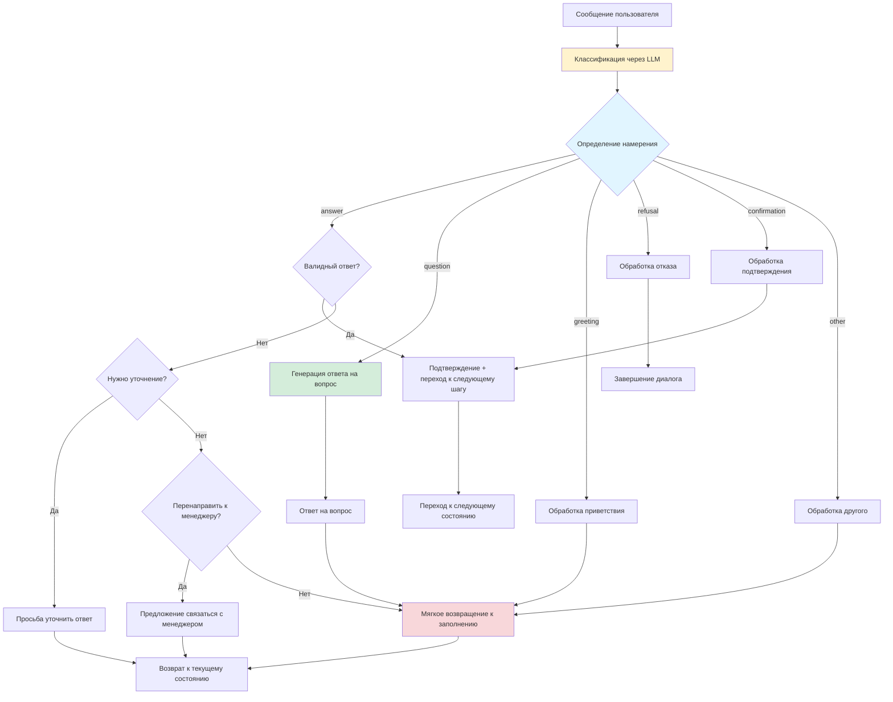
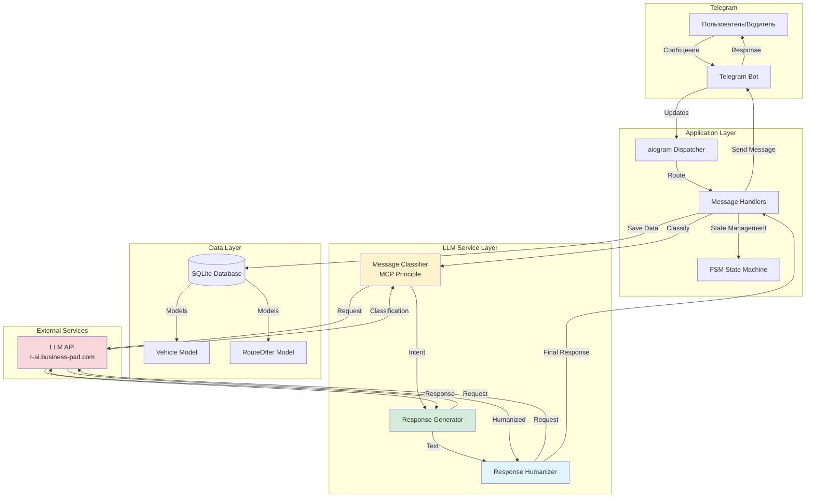
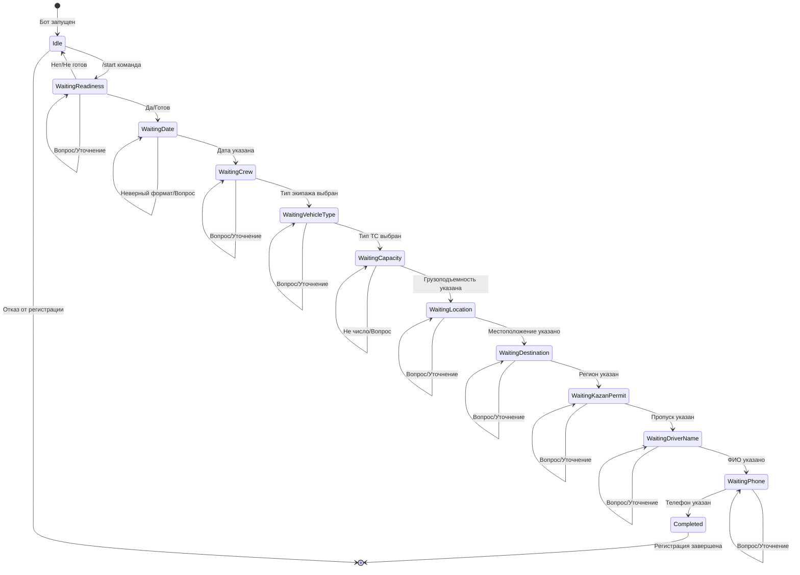
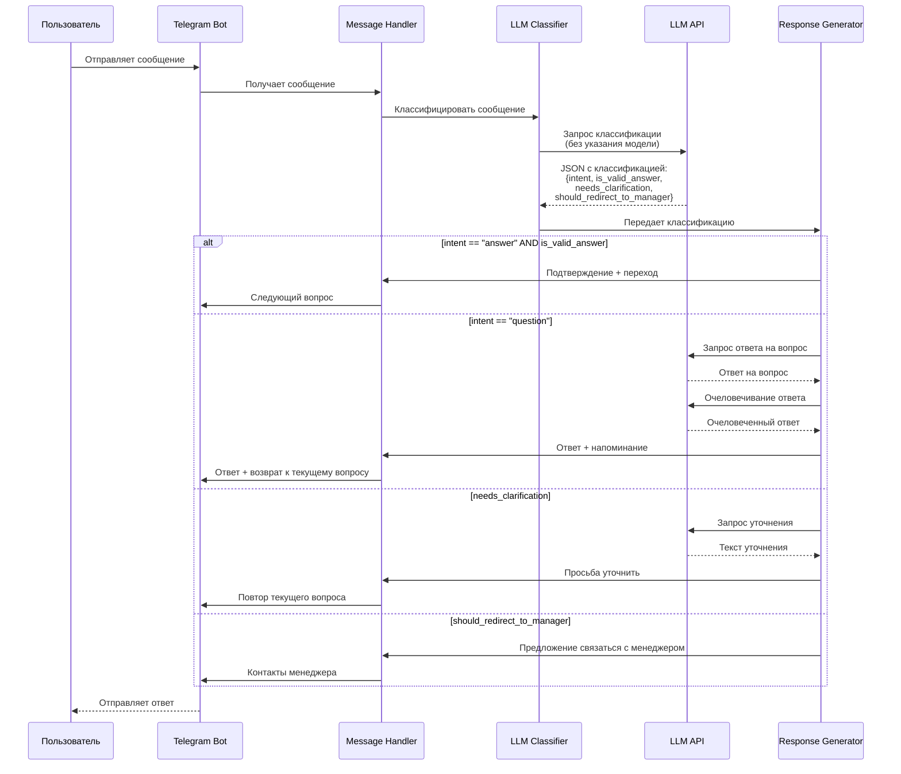

**1. Цель проекта**
Создать пилотную систему для автоматизации поиска и распределения свободного транспорта под заявки на перевозку. Ключевая задача — продемонстрировать работающий прототип (MVP) для получения одобрения на полноценное пилотное внедрение в компании-заказчике.

**2. Краткое описание**
Система состоит из двух основных модулей:
*   **AI-Чат-бот в Telegram:** для сбора данных о свободных машинах от водителей-партнеров.
*   **Внутренний процесс в CPQ/BPM-системе:** для автоматического сопоставления машин с заявками, согласования и исполнения маршрутов.

**3. Сценарий работы (Упрощенный MVP)**

**3.1. Этап 1: Регистрация машины через Telegram-бота**
*   Бот инициирует диалог: *"Здравствуйте! Есть ли у вас готовая машина?"*
*   Сценарий общения с водителем (последовательный опрос):
    1.  **Подтверждение готовности:** `Да` → переход к следующему вопросу.
    2.  **Дата готовности:** Уточнение, когда машина свободна.
    3.  **Экипаж:** Одиночный / Парный.
    4.  **Тип ТС:** (например, рефрижератор, тентованный и т.д.).
    5.  **Грузоподъемность/Объем:** Количество кубов.
    6.  **Текущее местоположение:** Город/регион.
    7.  **Регион назначения:** Куда готовы ехать.
    8.  **Наличие пропуска в Казань (блокирующий фактор):** Да/Нет.
    9.  **ФИО водителя:** Для документов.
    10. **Контактные данные:** Телефон.
*   **Устойчивость диалога:** Бот должен уметь обрабатывать стандартные отклонения (например, вопрос "А сколько заплатят?") и возвращать к сценарию. При сложных вопросах — предусмотреть возможность подключения живого менеджера.
*   **Результат:** Созданная заявка на партнерский транспорт попадает в общую базу (пул) в статусе "Свободна".

**3.2. Этап 2: Внутренний процесс распределения маршрутов**
1.  **Запуск процесса:** Процесс запускается для каждой "Свободной" машины.
2.  **Сбор данных:** Все данные из чат-бота заносятся в переменные процесса.
3.  **Поиск подходящих маршрутов (логика CPQ):**
    *   Система ищет в базе заявок на перевозку те, что соответствуют критериям:
        *   Совпадение пункта отправления и назначения.
        *   Соответствие типу ТС и грузоподъемности.
    *   **Правила приоритизации:** Сортировка заявок по "самым выгодным" (критерии уточняются).
    *   **Результат:** Система предлагает **3 наиболее подходящих маршрута**.
4.  **Временная "бронь":** Выбранные 3 маршрута меняют статус с "Не распределен" на "Предложен машине [ID]". Они не могут быть предложены другой машине в этот период.
5.  **Таймаут брони:** Через заданное время, если маршрут не выбран, бронь снимается, и маршрут возвращается в общий пул.

**3.3. Этап 3: Выбор и согласование маршрута**
1.  **Выбор:** Диспетчер вручную или система автоматически выбирает один из 3-х предложенных маршрутов.
2.  **Согласование:** Запускается процесс согласования с тремя участниками (например, менеджер, СБ, директор). Согласование проходит в интерфейсе CPQ.
3.  **Исполнение:**
    *   После согласования маршрут переходит в статус "В работе".
    *   Для двух невыбранных маршрутов бронь снимается, их статус возвращается в "Не распределен".
    *   Генерируются необходимые документы (договор, заказ-наряд).

**4. Технические требования к MVP**

*   **Интеграция с Telegram:** Чат-бот на базе фреймворка (например, `aiogram`).
*   **Backend:** Логика обработки данных, REST API для связи бота с CPQ.
*   **База данных:** Хранение данных о машинах, заявках, статусах.
*   **CPQ/BPM-платформа:**
    *   Моделирование процессов (статусы: Свободна -> Предложена -> В работе -> Исполнена).
    *   Визуализация флоу процесса.
    *   Механизм согласования.
    *   Генерация документов (шаблоны).
*   **Механизм актуализации данных:** Периодическая (каждые 30 мин) проверка актуальности заявок в пуле (не взяты ли в работу, не отменены и т.д.).

**5. Критерии успеха для демонстрации**

*   **Рабочий прототип:** Возможность пройти полный цикл от сообщения в боте до генерации документов по выбранному маршруту.
*   **Демонстрация эффективности:** Показать на тестовых данных, что система может находить подходящие заявки для партнерского транспорта, увеличивая общий объем выполненных перевозок.
*   **Простота и скорость:** Процесс должен быть интуитивно понятным и быстрым для диспетчера.

**6. Дальнейшее развитие (после пилота)**


# Схема работы Telegram-бота для регистрации транспорта

## Диаграмма потока работы бота

```mermaid
flowchart TD
    Start([Пользователь запускает бота]) --> /start[/start команда]
    /start --> Greeting[Приветствие и вопрос о готовности машины]
    Greeting --> State1{Состояние: waiting_for_readiness}
    
    State1 --> |Да/Готов| CreateVehicle[Создание записи в БД]
    State1 --> |Нет| End1[Завершение. Предложение вернуться позже]
    State1 --> |Нестандартный ответ| LLMClassify1[Классификация через LLM]
    
    LLMClassify1 --> ClassifyStep{Классификация сообщения}
    ClassifyStep --> |answer| ProcessAnswer1[Обработка как ответ]
    ClassifyStep --> |question| AnswerQuestion1[Ответ на вопрос + напоминание]
    ClassifyStep --> |other| Clarify1[Уточнение ответа]
    
    ProcessAnswer1 --> State1
    AnswerQuestion1 --> State1
    Clarify1 --> State1
    
    CreateVehicle --> State2{Состояние: waiting_for_date}
    State2 --> |Дата указана| SaveDate[Сохранение даты в БД]
    State2 --> |Неверный формат| AskDateAgain[Просьба указать дату правильно]
    State2 --> |Вопрос/Другое| LLMClassify2[Классификация через LLM]
    
    LLMClassify2 --> ClassifyStep
    
    AskDateAgain --> State2
    SaveDate --> State3{Состояние: waiting_for_crew}
    
    State3 --> |Одиночный/Парный| SaveCrew[Сохранение типа экипажа]
    State3 --> |Другое| LLMClassify3[Классификация через LLM]
    LLMClassify3 --> ClassifyStep
    SaveCrew --> State4{Состояние: waiting_for_vehicle_type}
    
    State4 --> |Тип ТС выбран| SaveVehicleType[Сохранение типа ТС]
    State4 --> |Другое| LLMClassify4[Классификация через LLM]
    LLMClassify4 --> ClassifyStep
    SaveVehicleType --> State5{Состояние: waiting_for_capacity}
    
    State5 --> |Число указано| SaveCapacity[Сохранение грузоподъемности]
    State5 --> |Не число| AskCapacityAgain[Просьба указать число]
    State5 --> |Вопрос/Другое| LLMClassify5[Классификация через LLM]
    LLMClassify5 --> ClassifyStep
    AskCapacityAgain --> State5
    SaveCapacity --> State6{Состояние: waiting_for_location}
    
    State6 --> |Местоположение указано| SaveLocation[Сохранение местоположения]
    State6 --> |Вопрос/Другое| LLMClassify6[Классификация через LLM]
    LLMClassify6 --> ClassifyStep
    SaveLocation --> State7{Состояние: waiting_for_destination}
    
    State7 --> |Регион указан| SaveDestination[Сохранение региона назначения]
    State7 --> |Вопрос/Другое| LLMClassify7[Классификация через LLM]
    LLMClassify7 --> ClassifyStep
    SaveDestination --> State8{Состояние: waiting_for_kazan_permit}
    
    State8 --> |Да/Нет| SavePermit[Сохранение информации о пропуске]
    State8 --> |Другое| LLMClassify8[Классификация через LLM]
    LLMClassify8 --> ClassifyStep
    SavePermit --> State9{Состояние: waiting_for_driver_name}
    
    State9 --> |ФИО указано| SaveDriverName[Сохранение ФИО водителя]
    State9 --> |Вопрос/Другое| LLMClassify9[Классификация через LLM]
    LLMClassify9 --> ClassifyStep
    SaveDriverName --> State10{Состояние: waiting_for_phone}
    
    State10 --> |Телефон указан| SavePhone[Сохранение телефона]
    State10 --> |Вопрос/Другое| LLMClassify10[Классификация через LLM]
    LLMClassify10 --> ClassifyStep
    SavePhone --> UpdateStatus[Обновление статуса: FREE]
    UpdateStatus --> Success[✅ Регистрация завершена!]
    Success --> End2([Конец регистрации])
    
    End1 --> End2
    
    style Start fill:#e1f5ff
    style End2 fill:#ffe1f5
    style Success fill:#d4edda
    style LLMClassify1 fill:#fff3cd
    style LLMClassify2 fill:#fff3cd
    style LLMClassify3 fill:#fff3cd
    style LLMClassify4 fill:#fff3cd
    style LLMClassify5 fill:#fff3cd
    style LLMClassify6 fill:#fff3cd
    style LLMClassify7 fill:#fff3cd
    style LLMClassify8 fill:#fff3cd
    style LLMClassify9 fill:#fff3cd
    style LLMClassify10 fill:#fff3cd
    style ClassifyStep fill:#fff3cd
```

## Схема классификации сообщений (MCP принцип)



## Архитектура системы



## Состояния FSM (State Machine)



## Процесс классификации сообщения (MCP)



## Описание состояний

| Состояние | Описание | Ожидаемый ответ |
|-----------|----------|----------------|
| `waiting_for_readiness` | Ожидание подтверждения готовности машины | Да/Нет |
| `waiting_for_date` | Ожидание даты готовности | Дата в формате ДД.ММ.ГГГГ ЧЧ:ММ |
| `waiting_for_crew` | Ожидание типа экипажа | Одиночный/Парный |
| `waiting_for_vehicle_type` | Ожидание типа ТС | Рефрижератор/Тентованный/Открытый/Контейнер/Цистерна/Другое |
| `waiting_for_capacity` | Ожидание грузоподъемности/объема | Число (кубические метры) |
| `waiting_for_location` | Ожидание местоположения | Город/регион |
| `waiting_for_destination` | Ожидание региона назначения | Регион назначения |
| `waiting_for_kazan_permit` | Ожидание информации о пропуске в Казань | Да/Нет |
| `waiting_for_driver_name` | Ожидание ФИО водителя | ФИО |
| `waiting_for_phone` | Ожидание контактных данных | Телефон |
| `completed` | Регистрация завершена | - |

## Типы классификации сообщений (MCP)

| Intent | Описание | Действие |
|--------|----------|----------|
| `answer` | Ответ на текущий вопрос | Проверка валидности → сохранение или уточнение |
| `question` | Вопрос пользователя | Ответ на вопрос + мягкое возвращение к заполнению |
| `greeting` | Приветствие | Дружелюбный ответ + возврат к текущему вопросу |
| `refusal` | Отказ продолжать | Принятие отказа + завершение диалога |
| `confirmation` | Подтверждение | Переход к следующему шагу |
| `other` | Другое | Уточнение или мягкое возвращение к заполнению |


*   Интеграция с системой мониторинга рынка (анализ конкурентов).
*   Голосовой AI-ассистент для обзвона водителей.
*   Полная автоматизация распределения без участия диспетчера.
*   Расширение библиотеки шаблонных решений в CPQ.
